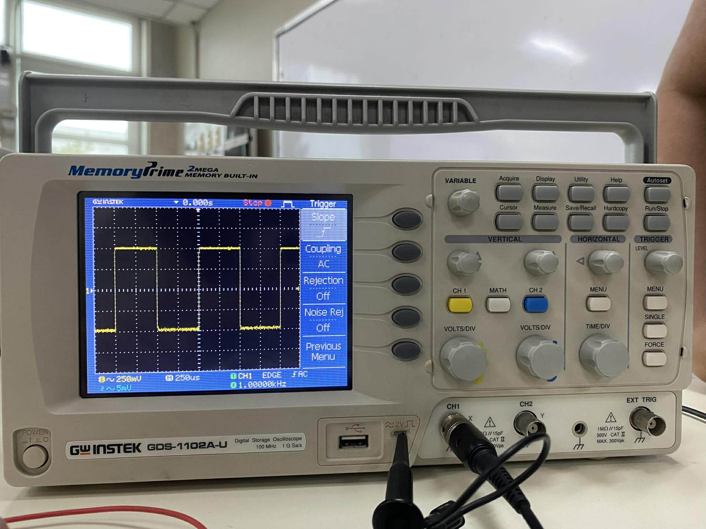

# The Emona Telecoms-Trainer 101 👾
This repository contains a collection of laboratory experiments for ETT 101 using the Emona Telecommunications Trainer. It is designed to help students understand fundamental communication and telecommunications principles through hands-on activities, practical measurements, and signal analysis.

## Table of Contents 📚
* [Part 1: Oscilloscope Setup and Signal Measurement](#-part-1-oscilloscope-setup-and-signal-measurement)

* [Part 2: Introduction to the Emona Telecommunications Trainer 101](#-part-2-introduction-to-the-emona-telecommunications-trainer-101)
  * [Part 2.1: Master Signals, Speech, and Buffer Module](#-part-21-master-signals-speech-and-buffer-module)
  * [Part 2.2: Adder and Phase Shifter Module](#-part-22-adder-and-phase-shifter-module)
  * [Part 2.3: Voltage-Controlled Oscillator (VCO) Module](#-part-23-voltage-controlled-oscillator-vco-module)
  
* [Part 3: Mathematical Equation Modeling Using the ETT 101](#-part-3-mathematical-equation-modeling-using-the-ett-101)

* [Part 4: Amplitude Modulation (AM)](#-part-4-amplitude-modulation-am)
  
# Part 1: Oscilloscope Setup and Signal Measurement 〰️

## Abstract
This experiment focused on the proper setup and operation of a dual-channel 20 MHz analog oscilloscope. The objective was to familiarize the user with essential oscilloscope controls required to obtain a stable and accurate waveform display. Through systematic configuration of the general, vertical, horizontal, and triggering controls, a stable AC signal was successfully observed. The experiment reinforces fundamental concepts such as amplitude, period, and frequency, which are critical for accurate signal measurement in electronics laboratories.
### Introduction
The oscilloscope is one of the most versatile and widely used instruments in electronics and communication engineering. It provides a visual representation of electrical signals by displaying voltage as a function of time. Proper oscilloscope setup is essential, as incorrect control settings can result in unstable waveforms or inaccurate measurements.
### Theoretical Background
An oscilloscope displays electrical signals in the time domain. The *amplitude* of a signal refers to its physical size and is measured in volts (V), commonly as peak or peak-to-peak voltage. The *period* is the time required for one complete cycle of a waveform and is measured in seconds (s). The *frequency* is the number of cycles per second and is measured in hertz (Hz), where frequency is the reciprocal of the period.

A *sine wave* is a smooth, continuous periodic waveform commonly used to represent AC signals. A *square wave* is a periodic signal that alternates between two discrete voltage levels and is often used in digital and timing applications.

### Experimental Results 

  
<strong>Waveform Output</strong>

  

    
  

